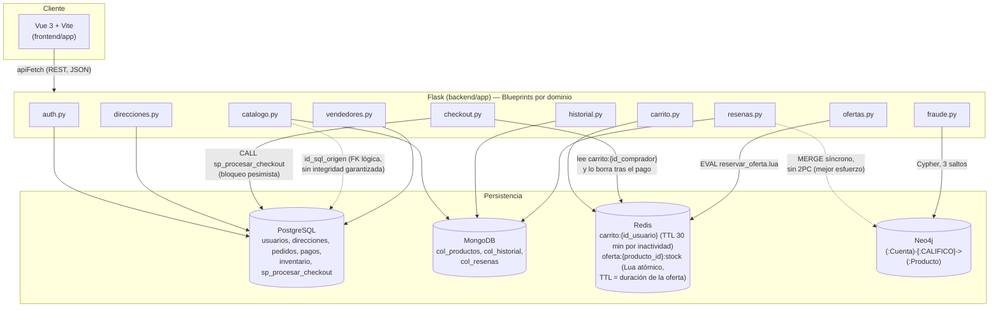

# Arquitectura de TiendaYa (actualizada — Entrega 2)

Arquitectura políglota: cada motor de persistencia cubre el rol para el que está mejor
adaptado, sin sincronización transaccional (2PC) entre ellos — cada integración documenta
explícitamente su ventana de consistencia.

## Notas de consistencia (para el registro de decisiones del curso)

- **Postgres ↔ Mongo (catálogo)**: el checkout descuenta stock en Postgres; el catálogo mostrado al público vive en Mongo. No están sincronizados automáticamente tras la migración inicial — limitación conocida, documentada desde la Entrega 1 (ver `README.md`).
- **Mongo ↔ Neo4j (reseñas/fraude)**: al crear una reseña, se escribe primero en Mongo (fuente de verdad) y luego se sincroniza a Neo4j en el mismo request. Si Neo4j falla, la reseña queda igualmente persistida en Mongo — se pierde solo la actualización del grafo, no el dato de negocio.
- **Redis (carrito y oferta límite)**: ambos son datos transitorios por diseño — el carrito expira por inactividad (30 min) y la oferta límite vence sola al terminar la duración indicada al crearla; además es un cupo independiente del inventario real de Postgres, no una fuente de verdad de stock.
- **Redis → Postgres (checkout)**: el checkout lee los productos del carrito guardado en Redis (no los que envía el navegador) y los pasa a `sp_procesar_checkout`, que valida precio y stock contra Postgres dentro de una transacción. Tras confirmar el pedido se borra el carrito; si ese borrado fallara, el pedido ya está confirmado y solo se registra una advertencia. Ver `docs/decisiones/ADR-003-redis-carrito-y-oferta.md`.
- **Sin autenticación centralizada**: ningún componente nuevo introduce JWT/sesión de servidor — se mantiene el patrón ya establecido en el proyecto (`id_usuario`/`rol_solicitante` viajan en cada request, sin verificación criptográfica del lado del servidor).
