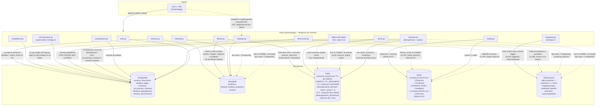

# Arquitectura de TiendaYa (actualizada — Entrega 3)

Arquitectura políglota: cada motor de persistencia cubre el rol para el que está mejor adaptado, sin sincronización transaccional (2PC) entre ellos. Cada integración documenta explícitamente su ventana de consistencia.

**Novedades de la Entrega 3** (en el diagrama): **Elasticsearch** como motor de búsqueda (`busqueda.py`), el **outbox** de sincronización en PostgreSQL (`eventos_sincronizacion`), que el checkout procesa al instante tras el COMMIT y su **relevo** reintenta si algo falla, la **clave de idempotencia** del checkout (`checkout_idempotencia`) y el panel de sincronización (`sincronizacion.py`).

**Cambios del 2026-10-07** (sin commit): `ofertas.py` lista las ofertas activas (`SCAN` en Redis más los datos del producto en MongoDB) para el sitio público y para el vendedor, y el carrito de Redis ya no tiene TTL salvo que se configure `CARRITO_TTL_SEGUNDOS` mayor que 0 ([ADR-006](decisiones/ADR-006-carrito-sin-expiracion-por-defecto.md)).

**Detección de fraude ampliada (2026-10-07, sin commit)** (en el diagrama): el grafo de Neo4j suma vendedores, direcciones de envío y compra verificada; `direcciones.py` ahora también escribe en Neo4j, `resenas.py` consulta en PostgreSQL si el autor compró el producto, y `fraude.py` corre cuatro patrones nuevos además de la consulta de la Entrega 2. Ver la sección [Grafo de fraude ampliado](#grafo-de-fraude-ampliado-2026-10-07) más abajo y [`deteccion-fraude-ampliada.md`](deteccion-fraude-ampliada.md).

```mermaid
flowchart TB
    subgraph Cliente
        Vue["Vue 3 + Vite\n(frontend/app)"]
    end

    subgraph Backend["Flask (backend/app) — Blueprints por dominio"]
        Auth[auth.py]
        Checkout["checkout.py\n(idempotencia + outbox)"]
        Direcciones[direcciones.py]
        Compradores[compradores.py]
        Catalogo[catalogo.py]
        Busqueda["busqueda.py\n(Entrega 3)"]
        Historial[historial.py]
        Vendedores[vendedores.py]
        Carrito[carrito.py]
        Ofertas[ofertas.py]
        Resenas[resenas.py]
        Fraude[fraude.py]
        Sincro["sincronizacion.py\n(panel admin, Entrega 3)"]
        Relevo["Relevo del outbox\n(hilo, cada 15 s)"]
    end

    subgraph Persistencia
        PG[("PostgreSQL\nusuarios, direcciones, pedidos, pagos,\ninventario, sp_procesar_checkout\ncheckout_idempotencia, eventos_sincronizacion")]
        Mongo[("MongoDB\nproductos, historial_cambios_productos,\nresenas")]
        Redis[("Redis\ncarrito:{id_usuario} (sin TTL por defecto;\nCARRITO_TTL_SEGUNDOS > 0 = expira por inactividad)\noferta:{producto_id}:stock / :limite / :precio / :id\n(TTL = duración de la oferta)\noferta:{producto_id}:reservas (reservas de 1 min)")]
        Neo4j[("Neo4j\n(:Cuenta)-[:CALIFICO]->(:Producto)\n+ (:Producto)-[:VENDIDO_POR]->(:Vendedor)\n+ (:Cuenta)-[:ENVIA_A]->(:Direccion)\n(2026-10-07)")]
        ES[("Elasticsearch\nalias productos -> productos_v + fecha\n(mapping propio, analizador español,\nsinónimos, autocompletado)")]
    end

    Vue -- "apiFetch (REST, JSON)" --> Backend

    Auth --> PG
    Direcciones --> PG
    Compradores -- "historial de pedidos" --> PG
    Checkout -- "1 transacción: clave de idempotencia +\nCALL sp_procesar_checkout + eventos (outbox)" --> PG
    Checkout -- "lee carrito, consume / compensa\nreservas de oferta (Lua)" --> Redis
    Checkout -. "tras el COMMIT, al instante:\ncerrar reservas, limpiar carrito" .-> Redis
    Checkout -. "tras el COMMIT, al instante:\nfijar stock = PostgreSQL" .-> Mongo
    Checkout -. "tras el COMMIT, al instante:\nfijar stock = PostgreSQL" .-> ES
    Relevo -- "eventos pendientes\n(FOR UPDATE SKIP LOCKED)" --> PG
    Relevo -. "cerrar reservas, limpiar carrito\n(Lua, idempotente)" .-> Redis
    Relevo -. "fijar stock = PostgreSQL" .-> Mongo
    Relevo -. "fijar stock = PostgreSQL;\nreindexar producto" .-> ES
    Sincro --> PG
    Catalogo --> Mongo
    Catalogo -. "id_sql_origen (FK lógica);\ncopia el stock editado en el admin" .-> PG
    Catalogo -. "indexa el producto al guardarlo\n(si falla, evento en el outbox)" .-> ES
    Busqueda -- "multi_match fuzzy, facetas (aggs),\nphrase suggester, autocompletado" --> ES
    Vue -. "respaldo si /api/busqueda responde 503:\nGET /api/productos?q= ($text)" .-> Catalogo
    Historial --> Mongo
    Vendedores --> PG
    Carrito --> Redis
    Ofertas -- "EVALSHA crear / consultar /\nreservar_oferta.lua;\nSCAN oferta:*:id (listados)" --> Redis
    Ofertas -- "dueño y precio_base;\nnombre, imagen, categoría y vendedor\nde las ofertas listadas" --> Mongo
    Resenas --> Mongo
    Resenas -. "MERGE síncrono,\nsin 2PC (mejor esfuerzo)" .-> Neo4j
    Fraude -- "Cypher, 3 saltos" --> Neo4j
    Resenas -- "¿compró el producto?\n(pedidos + líneas, 2026-10-07)" --> PG
    Direcciones -. "ENVIA_A tras el COMMIT,\nsin 2PC (mejor esfuerzo, 2026-10-07)" .-> Neo4j
    Fraude -- "4 patrones + resumen\n(2026-10-07)" --> Neo4j
```

Líneas continuas: escritura o lectura en la fuente de verdad de ese dato. Líneas punteadas: copias o proyecciones que pueden quedar atrasadas un tiempo acotado (y el camino de respaldo del buscador, que el frontend usa solo si Elasticsearch no responde).

## Notas de consistencia (para el registro de decisiones del curso)

- **Checkout (PostgreSQL + Redis + MongoDB + Elasticsearch)**: PostgreSQL es la única transacción ACID y la única que decide si hubo compra. Antes del COMMIT, las reservas de oferta consumidas en Redis se **compensan** si algo falla. En el COMMIT, el pedido, la clave de idempotencia y los eventos de sincronización se confirman juntos. Después del COMMIT, el propio `checkout.py` ejecuta esos eventos en el acto, en el mismo request (`sincronizacion.procesar`); si un motor falla, el evento queda pendiente y el relevo lo **reintenta** (son idempotentes). Detalle de cada punto de falla y prueba de falla simulada en [`estrategia-consistencia-checkout.md`](estrategia-consistencia-checkout.md).
- **Postgres → Mongo y Elasticsearch (stock)**: tras cada compra, el stock se copia por el outbox, con reintentos. Ventana de consistencia medida en las pruebas ([evidencia](evidencia/prueba_fallas_checkout.txt)): MongoDB se corrigió 20 s después de la falla y Elasticsearch 25 s después de volver a levantarlo (en la corrida del 2026-10-06, 12 s y 31 s). Varía según en qué momento del ciclo del relevo (15 s) cae el reintento. Al editar el stock desde el admin, el cambio se copia al `inventario` de Postgres (mejor esfuerzo). El precio y el resto de los campos editados en el admin siguen solo en Mongo (ver `README.md`).
- **Mongo → Elasticsearch (catálogo)**: el índice es una proyección de solo lectura de la colección `productos`. Al guardar un producto desde el admin se reindexa en el acto; si Elasticsearch no responde, queda un evento `indexar_producto` en el outbox. Se puede reconstruir entero con `database/migrations/indexar_productos_elasticsearch.py`, sin cortar el servicio (alias). Si Elasticsearch está caído, `busqueda.py` responde 503 (`BUSCADOR_NO_DISPONIBLE`) y es el frontend (`ResultadosBusqueda.vue`) el que repite la búsqueda contra `GET /api/productos?q=` (índice `$text` de Mongo, en `catalogo.py`) y muestra un aviso de búsqueda simplificada. El `503` es solo para cuando el motor no está disponible (conexión, timeout, índice inexistente, `401`/`403`, `429`, `5xx`); si Elasticsearch está arriba y rechaza la consulta, `busqueda.py` responde `400 BUSQUEDA_NO_VALIDA` y el frontend no cae al respaldo (desde el 2026-10-06, [H-002](hallazgos.md)). Ver [`decisiones/ADR-004-motor-de-busqueda.md`](decisiones/ADR-004-motor-de-busqueda.md).
- **Mongo ↔ Neo4j (reseñas y fraude)**: al crear una reseña, se escribe primero en Mongo (fuente de verdad) y luego se sincroniza a Neo4j en el mismo request. Si Neo4j falla, la reseña queda igualmente guardada en Mongo: se pierde solo la actualización del grafo, no el dato de negocio. No pasa por el outbox, porque no es parte del checkout.
  - Desde el 2026-10-07 también se copian al grafo las direcciones de PostgreSQL; ver [Grafo de fraude ampliado](#grafo-de-fraude-ampliado-2026-10-07).
- **Redis (carrito y oferta límite)**: ambos son datos transitorios por diseño. El carrito expira por inactividad cuando `CARRITO_TTL_SEGUNDOS` es mayor que 0 (30 min en la Entrega 2); desde el 2026-10-07 el valor por defecto es `0` y entonces el carrito no expira (decisión registrada en [`decisiones/ADR-006-carrito-sin-expiracion-por-defecto.md`](decisiones/ADR-006-carrito-sin-expiracion-por-defecto.md); para demostrar la expiración se configura un valor mayor que 0). La oferta límite vence sola al terminar la duración indicada al crearla. La oferta es un cupo independiente del inventario real de Postgres: reservar aparta unidades por 1 minuto sin descontar nada, y solo el checkout descuenta el cupo en Redis y el `inventario` en Postgres. Los listados de ofertas (`GET /api/ofertas` y `GET /api/vendedores/<id>/ofertas`, desde el 2026-10-07) encuentran las ofertas activas con `SCAN` sobre `oferta:*:id` y confirman cada una con `consultar_oferta.lua`, porque puede vencer entre el `SCAN` y la lectura. Ver [`decisiones/ADR-003-redis-carrito-y-oferta.md`](decisiones/ADR-003-redis-carrito-y-oferta.md).
- **Pagos en PostgreSQL**: se evaluó migrarlos a un motor NewSQL y se decidió no hacerlo. Ver [`decisiones/ADR-005-newsql-pagos.md`](decisiones/ADR-005-newsql-pagos.md).
- **Sin autenticación centralizada**: ningún componente introduce JWT o sesión de servidor. Se mantiene el patrón ya establecido en el proyecto (`id_usuario` y `rol_solicitante` viajan en cada request, sin verificación criptográfica del lado del servidor), Redis y Elasticsearch corren sin autenticación, y Neo4j solo con su usuario administrador por defecto, sin roles por servicio. Es requisito de la entrega final.

## Grafo de fraude ampliado (2026-10-07)

Se agregó después de la Entrega 3, sin quitar nada del grafo de la Entrega 2. Explicación completa en [`deteccion-fraude-ampliada.md`](deteccion-fraude-ampliada.md); la decisión, en [`decisiones/ADR-007-deteccion-fraude-ampliada.md`](decisiones/ADR-007-deteccion-fraude-ampliada.md).

- **Qué agrega al grafo**: `(:Producto)-[:VENDIDO_POR]->(:Vendedor)` (y `Producto.id_vendedor`), la propiedad `compra_verificada` en cada `CALIFICO` y `(:Cuenta)-[:ENVIA_A]->(:Direccion)`. Las constraints de `Vendedor.id_vendedor` y `Direccion.clave` están en `database/neo4j/02_fraude_ampliado.cypher`. El nodo `Direccion` se identifica por una clave normalizada (minúsculas y espacios simples en la línea 1, la ciudad y el código postal), para que la misma dirección escrita distinto quede en un solo nodo.
- **De dónde sale cada dato**: el vendedor, del documento del producto en MongoDB; `compra_verificada`, de `pedidos` + `lineas_pedido` en PostgreSQL (el mismo criterio que el "compra verificada" del listado de reseñas); las direcciones, de la tabla `direcciones` de PostgreSQL. Neo4j sigue sin ser fuente de verdad de nada: es una proyección para detectar fraude.
- **Cuándo se copia**: `resenas.py`, al crear la reseña (el vendedor y `compra_verificada` van en la misma transacción de Neo4j que el `CALIFICO`); `direcciones.py`, después del commit en PostgreSQL al crear, editar o borrar una dirección, deja las `ENVIA_A` de la cuenta iguales a sus direcciones actuales (`backend/app/grafo_fraude.py`). Es mejor esfuerzo, igual que el espejo de reseñas: si Neo4j falla, la reseña o la dirección quedan guardadas y solo se registra una advertencia. No pasa por el outbox, porque no es parte del checkout.
- **Ventana de consistencia**: normalmente ninguna, porque la copia ocurre en el mismo request. Si Neo4j falló, o si dos cambios de direcciones del mismo usuario se cruzaron (carrera aceptada, [H-020](hallazgos.md)), el grafo queda atrasado hasta la próxima reseña o edición de direcciones de esa cuenta, o hasta correr `database/migrations/sincronizar_grafo_fraude.py`, que reconstruye todo lo agregado (idempotente, solo `MERGE`/`SET`).
- **Consultas**: `fraude.py` corre los patrones `cuenta_rafaga`, `grupo_coordinado`, `sesgo_vendedor_sin_compra` y `cuentas_vinculadas` (`GET /api/fraude/patrones`, `/api/fraude/alertas/<tipo>` y `/api/fraude/resumen`), además de la consulta de la Entrega 2 (`GET /api/fraude/alertas`), que no cambió. Si Neo4j no responde, las rutas nuevas devuelven `503 GRAFO_NO_DISPONIBLE`.
