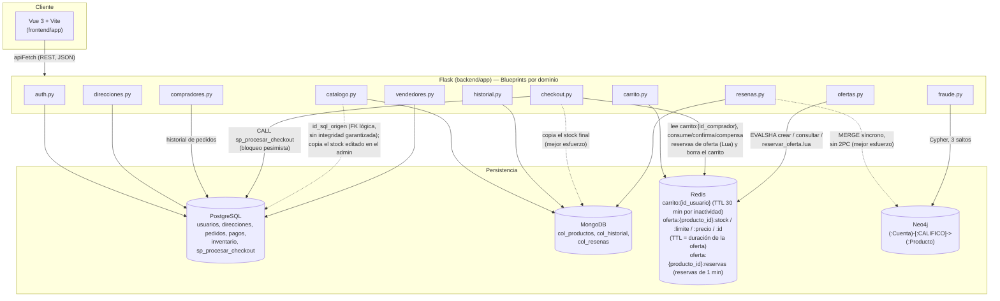

# Arquitectura de TiendaYa (actualizada — Entrega 2)

Arquitectura políglota: cada motor de persistencia cubre el rol para el que está mejor
adaptado, sin sincronización transaccional (2PC) entre ellos — cada integración documenta
explícitamente su ventana de consistencia.

```mermaid
flowchart TB
    subgraph Cliente
        Vue["Vue 3 + Vite\n(frontend/app)"]
    end

    subgraph Backend["Flask (backend/app) — Blueprints por dominio"]
        Auth[auth.py]
        Checkout[checkout.py]
        Direcciones[direcciones.py]
        Compradores[compradores.py]
        Catalogo[catalogo.py]
        Historial[historial.py]
        Vendedores[vendedores.py]
        Carrito[carrito.py]
        Ofertas[ofertas.py]
        Resenas[resenas.py]
        Fraude[fraude.py]
    end

    subgraph Persistencia
        PG[("PostgreSQL\nusuarios, direcciones, pedidos, pagos,\ninventario, sp_procesar_checkout")]
        Mongo[("MongoDB\ncol_productos, col_historial,\ncol_resenas")]
        Redis[("Redis\ncarrito:{id_usuario} (TTL 30 min por inactividad)\noferta:{producto_id}:stock / :limite / :precio / :id\n(TTL = duración de la oferta)\noferta:{producto_id}:reservas (reservas de 1 min)")]
        Neo4j[("Neo4j\n(:Cuenta)-[:CALIFICO]->(:Producto)")]
    end

    Vue -- "apiFetch (REST, JSON)" --> Backend

    Auth --> PG
    Direcciones --> PG
    Compradores -- "historial de pedidos" --> PG
    Checkout -- "CALL sp_procesar_checkout\n(bloqueo pesimista)" --> PG
    Catalogo --> Mongo
    Catalogo -. "id_sql_origen (FK lógica,\nsin integridad garantizada);\ncopia el stock editado en el admin" .-> PG
    Historial --> Mongo
    Vendedores --> PG
    Carrito --> Redis
    Checkout -- "lee carrito:{id_comprador}, consume/confirma/compensa\nreservas de oferta (Lua) y borra el carrito" --> Redis
    Checkout -. "copia el stock final\n(mejor esfuerzo)" .-> Mongo
    Ofertas -- "EVALSHA crear / consultar /\nreservar_oferta.lua" --> Redis
    Resenas --> Mongo
    Resenas -. "MERGE síncrono,\nsin 2PC (mejor esfuerzo)" .-> Neo4j
    Fraude -- "Cypher, 3 saltos" --> Neo4j
```

## Notas de consistencia (para el registro de decisiones del curso)

- **Postgres ↔ Mongo (catálogo)**: el checkout descuenta stock en Postgres; el catálogo mostrado al público vive en Mongo. Solo el **stock** se sincroniza, de mejor esfuerzo y sin 2PC: tras confirmar un pedido, el checkout lee el stock que quedó en Postgres y lo copia a Mongo; al editar el stock desde el admin, el cambio se copia al `inventario` de Postgres. Si la copia falla, la operación principal queda hecha y solo se registra una advertencia. El precio y el resto de los campos editados en el admin siguen solo en Mongo (ver `README.md`).
- **Mongo ↔ Neo4j (reseñas/fraude)**: al crear una reseña, se escribe primero en Mongo (fuente de verdad) y luego se sincroniza a Neo4j en el mismo request. Si Neo4j falla, la reseña queda igualmente persistida en Mongo — se pierde solo la actualización del grafo, no el dato de negocio.
- **Redis (carrito y oferta límite)**: ambos son datos transitorios por diseño — el carrito expira por inactividad (30 min) y la oferta límite vence sola al terminar la duración indicada al crearla. La oferta es un cupo independiente del inventario real de Postgres: reservar aparta unidades por 1 minuto sin descontar nada, y solo el checkout descuenta el cupo en Redis y el `inventario` en Postgres.
- **Redis → Postgres (checkout)**: el checkout lee los productos del carrito guardado en Redis (no los que envía el navegador) y los pasa a `sp_procesar_checkout`, que valida precio y stock contra Postgres dentro de una transacción. Las líneas de oferta se consumen antes en Redis (reserva `en_pago`); si el procedimiento falla, se compensan y las unidades vuelven a la oferta. Tras confirmar el pedido se borra el carrito; si ese borrado fallara, el pedido ya está confirmado y solo se registra una advertencia. Ver `docs/decisiones/ADR-003-redis-carrito-y-oferta.md`.
- **Sin autenticación centralizada**: ningún componente nuevo introduce JWT/sesión de servidor — se mantiene el patrón ya establecido en el proyecto (`id_usuario`/`rol_solicitante` viajan en cada request, sin verificación criptográfica del lado del servidor).
