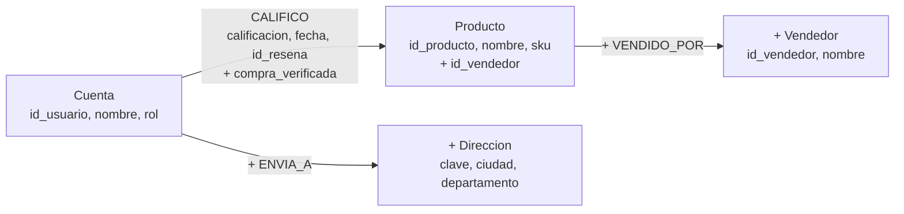

# Detección de fraude ampliada en reseñas (Neo4j)

Fecha: 2026-10-07 (después de la Entrega 3)

Este documento describe una **ampliación** de la detección de fraude en reseñas. No reemplaza a la de la Entrega 2: la consulta original de anillos de 3 cuentas (`GET /api/fraude/alertas`) sigue igual, con la misma respuesta, y tiene su propia pestaña en el panel. Lo de la Entrega 2 está descrito en [ADR-002](decisiones/ADR-002-grafos-vs-columnar.md), en el [informe de la Entrega 2](informe-entrega-2.md) y en las secciones 1 a 8 de la [guía de prueba de fraude](guia-prueba-fraude.md). La decisión de ampliarla está en [ADR-007](decisiones/ADR-007-deteccion-fraude-ampliada.md).

Archivos principales:

| Archivo | Qué contiene |
|---|---|
| `backend/app/blueprints/fraude.py` | Consulta original (Entrega 2) y los 4 detectores nuevos, más `/patrones` y `/resumen` |
| `backend/app/grafo_fraude.py` | Sincronización del grafo ampliado desde el backend (mejor esfuerzo) |
| `backend/app/blueprints/resenas.py`, `backend/app/blueprints/direcciones.py` | Llaman a esa sincronización después de guardar en Mongo o PostgreSQL |
| `database/neo4j/02_fraude_ampliado.cypher` | Constraints nuevas y descripción del modelo |
| `database/migrations/sincronizar_grafo_fraude.py` | Completa el grafo para los datos que ya existían (idempotente) |
| `database/migrations/sembrar_fraude_ampliado.py` | Siembra 11 escenarios: positivos y controles |
| `backend/scripts/prueba_fraude_ampliado.py` | Prueba contra la API real (59 verificaciones) |
| `frontend/app/src/components/admin/GestionFraude.vue` y componentes `ResumenFraude.vue`, `AnillosResenas.vue`, `AlertasPatron.vue`, `AlertaFraude.vue`; `frontend/app/src/utils/fraude.js` | Panel `/admin/fraude` |

## 1. Motivación

La consulta de la Entrega 2 busca un solo patrón: **tríos** de cuentas que se ponen **5 estrellas** en al menos 3 productos en común, con a lo sumo 6 horas entre las dos reseñas de cada producto. Funciona para el anillo que siembra `sembrar_resenas_fraude.py`, pero deja fuera casos que la usuaria pidió cubrir:

- **Reseñas malas, no solo buenas.** Una campaña para hundir los productos de un competidor (todas de 1-2 estrellas) no aparece, porque la consulta exige 5 estrellas.
- **Grupos de cualquier tamaño, no solo tríos.** Un grupo de 5 cuentas sale como 10 tríos superpuestos (C(5,3)), y un grupo en cadena (A coincide con B, B con C, pero A no con C) no sale.
- **Una sola cuenta que reseña muchos productos en poco tiempo sin compra verificada.** La consulta original necesita al menos 3 cuentas, así que una cuenta automatizada que actúa sola nunca aparece.

Para cubrirlos se agregaron **4 patrones nuevos**, cada uno con su propia consulta de varios saltos en el grafo. Dos de ellos usan información que el grafo de la Entrega 2 no tenía (vendedor del producto, compra verificada y dirección de envío), por eso el modelo del grafo también se amplió (sección 3).

| Tipo | Nombre en el panel | Qué cubre |
|---|---|---|
| `cuenta_rafaga` | Cuenta en ráfaga | Una cuenta, muchas reseñas en poco tiempo, casi todas sin compra |
| `grupo_coordinado` | Grupo coordinado | Grupos de cualquier tamaño, con 5 estrellas o con 1-2 estrellas |
| `sesgo_vendedor_sin_compra` | Cuenta sesgada hacia un vendedor | Una cuenta que infla o hunde a una tienda a la que nunca le compró |
| `cuentas_vinculadas` | Cuentas vinculadas | Varias cuentas de la misma dirección que califican igual |

## 2. Los 4 patrones nuevos

### 2.1 Convenciones comunes

Estas reglas valen para los 4 detectores (cabecera de la sección "Detección de fraude ampliada" en `backend/app/blueprints/fraude.py`):

- **"Sin compra"** es `NOT coalesce(r.compra_verificada, false)`. Una relación `CALIFICO` que todavía no tiene la propiedad (una reseña anterior al backfill) cuenta como sin compra verificada, porque es lo único que se puede afirmar con lo que hay en el grafo. Después de correr `sincronizar_grafo_fraude.py` todas la tienen.
- **Las ventanas de tiempo** se miden con `datetime(r.fecha)`, porque `fecha` se guarda como texto ISO 8601 (igual que en la Entrega 2).
- **"N reseñas dentro de una ventana"** se busca con una ventana deslizante anclada en cada reseña: para cada reseña se cuentan las que caen entre su fecha y su fecha más la ventana, y se queda la mejor. Toda ráfaga empieza en alguna reseña, así que no se pierde ninguna.
- **Todos los valores llegan como parámetros** de la consulta (`$...`). Nunca se interpola texto del usuario en el Cypher.
- **El score (0 a 100)** se calcula en Python con los números que devuelve la consulta, con la fórmula de cada patrón, y se acota a 0-100. El **nivel** es `alto` si el score es 70 o más, `medio` si es 40 o más y `bajo` si es menor que 40.
- Neo4j devuelve a lo sumo 500 filas candidatas por detector (5 000 pares en `grupo_coordinado`). La API ordena por score descendente y devuelve las 50 mejores; `total` dice cuántas se detectaron.

Todas las alertas nuevas tienen la misma forma:

```json
{
  "tipo": "cuenta_rafaga",
  "cuentas": [{"id_usuario": 145, "nombre": "Jonathan Ixcoy"}],
  "productos": [{"id_producto": "PROD-0782", "nombre": "..."}],
  "vendedor": null,
  "score": 96,
  "nivel": "alto",
  "motivo": "frase en español que explica por qué se disparó",
  "evidencia": {"...": "números propios de cada patrón"}
}
```

### 2.2 `cuenta_rafaga` — Cuenta en ráfaga

**Qué detecta.** Una sola cuenta con al menos `min_resenas` reseñas, de cualquier calificación, dentro de `ventana_segundos`, de las cuales al menos `min_pct_sin_compra` % son sin compra verificada.

**Por qué es anómalo.** Una persona real reseña de a poco lo que va recibiendo. Muchas reseñas de productos distintos en minutos, casi todas de cosas que nunca compró, apuntan a una cuenta automatizada o a una "granja" de reseñas. Se mira **cualquier calificación** porque estas cuentas suelen variar las estrellas justamente para no parecer sospechosas.

**La consulta, en palabras.** (1) Por cada cuenta, toma cada una de sus reseñas como posible inicio de una ráfaga. (2) Desde ese inicio, recorre de nuevo `Cuenta → CALIFICO → Producto` y junta las reseñas que caen dentro de la ventana. (3) Descarta las ventanas con menos reseñas que el mínimo o con un porcentaje sin compra menor que el pedido. (4) Por cuenta, se queda con la ventana con más reseñas (y, si empatan, la más corta).

```cypher
MATCH (c:Cuenta)-[r0:CALIFICO]->(:Producto)
WITH DISTINCT c, datetime(r0.fecha) AS inicio
MATCH (c)-[r:CALIFICO]->(p:Producto)
WHERE datetime(r.fecha) >= inicio
  AND datetime(r.fecha) <= inicio + duration({seconds: $ventana_segundos})
WITH c, inicio, p, r
ORDER BY datetime(r.fecha)
WITH c, inicio,
     collect({id_producto: p.id_producto, nombre: p.nombre, calificacion: r.calificacion}) AS resenas,
     sum(CASE WHEN NOT coalesce(r.compra_verificada, false) THEN 1 ELSE 0 END) AS sin_compra,
     max(datetime(r.fecha)) AS fin
WHERE size(resenas) >= $min_resenas
  AND 100.0 * sin_compra / size(resenas) >= $min_pct_sin_compra
-- ... se queda con la mejor ventana de cada cuenta
```

**Parámetros por defecto y por qué.**

| Parámetro | Default | Justificación |
|---|---|---|
| `min_resenas` | 5 | El ruido legítimo reparte las reseñas de cada cuenta en 30 días, y los anillos de la semilla original hacen 4 reseñas por cuenta en unas 2 horas: ninguno llega a 5 en una hora. Con 4 reseñas en 6 horas ya aparecen las cuentas del anillo de la Entrega 2; con 3 en una hora aparece casi cualquier cuenta de un grupo, y eso ya lo cubre `grupo_coordinado`. |
| `ventana_segundos` | 3600 (1 hora) | Mismo razonamiento. |
| `min_pct_sin_compra` | 80 | Casi todas sin compra. Admite entre 1 y 100. |

**Score.** `50 + 5 × (reseñas − min_resenas) + 30 × (1 − duración real / ventana) + 20 × margen`, donde `margen` es lo que el porcentaje sin compra supera al mínimo, dividido entre lo que le faltaba al mínimo para llegar a 100. Ejemplo con la semilla: 8 reseñas en 39 minutos, todas sin compra → 50 + 15 + 10.5 + 20 = **96 (alto)**.

**Evidencia.** `resenas`, `resenas_sin_compra`, `sin_compra_pct`, `distribucion_calificaciones` (cuántas de 1 a 5 estrellas), `inicio`, `ventana_real_minutos`, `ventana_maxima_minutos`.

### 2.3 `grupo_coordinado` — Grupo coordinado

**Qué detecta.** Un grupo de al menos `min_cuentas` cuentas, de cualquier tamaño, conectadas entre sí. Dos cuentas quedan **enlazadas** si calificaron al menos `min_productos_compartidos` productos en común con el **mismo signo extremo** (las dos 5 estrellas, o las dos 1-2 estrellas) y con sus dos reseñas de cada producto a no más de `ventana_segundos` entre sí. El grupo es la **componente conexa** de esos enlaces: si A está enlazada con B y B con C, el grupo es {A, B, C} aunque A y C no coincidan directamente. Positivo y negativo se calculan por separado y dan alertas distintas (`evidencia.signo`).

**Por qué es anómalo.** Generaliza el anillo de la Entrega 2 (tríos fijos de 5 estrellas) a grupos de cualquier tamaño y a campañas negativas. Que varias cuentas opinen lo mismo, en extremo, sobre los mismos productos y casi a la misma hora es una acción concertada, no opiniones independientes.

**La consulta, en palabras.** (1) Recorre `Cuenta → CALIFICO → Producto ← CALIFICO ← Cuenta` para encontrar pares de cuentas que calificaron el mismo producto con el mismo signo extremo. (2) Se queda con las coincidencias dentro de la ventana. (3) Agrupa por par y signo, y conserva los pares con suficientes productos en común. Cypher devuelve solo los **pares enlazados**; las componentes conexas se arman en Python con **union-find** (función `_componentes`), porque el docker del curso no trae el plugin GDS de Neo4j (sección 3.3).

```cypher
MATCH (a:Cuenta)-[r1:CALIFICO]->(p:Producto)<-[r2:CALIFICO]-(b:Cuenta)
WHERE a.id_usuario < b.id_usuario
  AND ((r1.calificacion = 5 AND r2.calificacion = 5)
       OR (r1.calificacion <= 2 AND r2.calificacion <= 2))
WITH a, b, p, r1, r2,
     CASE WHEN r1.calificacion = 5 THEN 'positivo' ELSE 'negativo' END AS signo,
     abs(duration.inSeconds(datetime(r1.fecha), datetime(r2.fecha)).seconds) AS diferencia
WHERE diferencia <= $ventana_segundos
-- ... agrupa por (a, b, signo)
WHERE size(productos) >= $min_productos_compartidos
RETURN a.id_usuario AS id_a, b.id_usuario AS id_b, signo, productos, diferencia_max, sin_compra
```

**Parámetros por defecto y por qué.**

| Parámetro | Default | Justificación |
|---|---|---|
| `min_cuentas` | 3 | Evita marcar parejas sueltas. Para parejas está `cuentas_vinculadas`, que además pide la misma dirección. |
| `min_productos_compartidos` | 2 | Alcanza para ver grupos que el anillo original, que pide 3 por par, no ve. |
| `ventana_segundos` | 21600 (6 horas) | La misma ventana del anillo original. |

**Score.** `40 + 10 × (cuentas − min_cuentas) + 30 × densidad + 20 × proporción sin compra`. La densidad es `enlaces / pares posibles del grupo`: vale 1 si todos coinciden con todos, y una cadena A-B-C tiene 2/3. Un grupo del tamaño mínimo, todo enlazado y sin compras, da 90.

**Evidencia.** `tamano`, `signo`, `enlaces`, `densidad_pct`, `productos_en_comun`, `pares` (qué parejas coinciden y en cuántos productos), `resenas_sin_compra_pct`, `ventana_real_minutos`, `ventana_maxima_minutos`.

**Relación con la Entrega 2.** El anillo de 4 cuentas que la consulta original devuelve como 4 tríos (cuentas 4, 5, 12 y 13) aquí aparece como **un solo grupo positivo de 4** (score 97 en la corrida del 2026-10-07).

### 2.4 `sesgo_vendedor_sin_compra` — Cuenta sesgada hacia un vendedor

**Qué detecta.** Una cuenta con al menos `min_resenas` reseñas **sin compra verificada** a productos de **un mismo vendedor**, todas del mismo signo extremo: todas de 5 estrellas (promotora) o todas de 1-2 estrellas (detractora). Cada signo se cuenta por separado: una cuenta puede ser promotora de una tienda y detractora de otra, y son dos alertas.

**Por qué es anómalo.** Un comprador real reseña lo que compró y reparte sus opiniones entre tiendas. Varias calificaciones extremas a la misma tienda sin haberle comprado nada es el perfil de una cuenta pagada para inflar (o hundir) la reputación de ese vendedor. El tiempo no forma parte del patrón, porque una cuenta así puede ir despacio; la evidencia informa el período que cubren sus reseñas.

**La consulta, en palabras.** (1) Recorre `Cuenta → CALIFICO → Producto → VENDIDO_POR → Vendedor` quedándose con las reseñas extremas sin compra. (2) Agrupa por cuenta, vendedor y signo, y conserva los grupos con al menos `min_resenas` productos. (3) Vuelve a recorrer todas las reseñas de la cuenta (para medir qué tan concentrada está en ese vendedor) y las que dejó a ese vendedor.

```cypher
MATCH (c:Cuenta)-[r:CALIFICO]->(p:Producto)-[:VENDIDO_POR]->(v:Vendedor)
WHERE (r.calificacion = 5 OR r.calificacion <= 2)
  AND NOT coalesce(r.compra_verificada, false)
WITH c, v, p, r, CASE WHEN r.calificacion = 5 THEN 'positivo' ELSE 'negativo' END AS signo
-- ... agrupa por (c, v, signo)
WHERE size(productos) >= $min_resenas
MATCH (c)-[rt:CALIFICO]->(:Producto)
WITH c, v, signo, productos, calificaciones, desde, hasta, count(rt) AS total_cuenta
OPTIONAL MATCH (c)-[rv:CALIFICO]->(:Producto)-[:VENDIDO_POR]->(v)
-- ... devuelve total_cuenta, total_vendedor y el período
```

**Parámetro por defecto y por qué.**

| Parámetro | Default | Justificación |
|---|---|---|
| `min_resenas` | 3 | Verificado con la semilla. Con 2 aparecen los controles (`promotor_control` y `detractor_control`, con 2 reseñas extremas a una tienda), cuentas de otros escenarios y cuentas del ruido legítimo que por azar dieron 5 (o 2) estrellas a 2 productos de la misma tienda, porque las tiendas grandes concentran reseñas. En la corrida del 2026-10-07, con 2 salen 21 alertas; con 3 salen 6: los escenarios `promotor` y `detractor` y las 4 cuentas del anillo de la Entrega 2. |

**Score.** `40 + 10 × (reseñas − min_resenas) + 40 × concentración`, donde `concentración = reseñas extremas sin compra a ese vendedor / todas las reseñas de la cuenta`. Justo en el umbral, con una cuenta que además reseña otras cosas, queda en `medio`; una cuenta dedicada casi solo a ese vendedor, o con muchas reseñas de más, sube a `alto`. Ejemplo: el escenario `promotor` tiene 4 reseñas y todas son a ese vendedor → 40 + 10 + 40 = **90**.

**Evidencia.** `signo`, `resenas_extremas_sin_compra`, `calificaciones`, `resenas_al_vendedor`, `resenas_totales_cuenta`, `concentracion_pct`, `periodo_dias`. Es el único patrón que llena `vendedor` en la alerta.

### 2.5 `cuentas_vinculadas` — Cuentas vinculadas

**Qué detecta.** Dos o más cuentas que envían a la **misma dirección** (el mismo nodo `Direccion`, por clave normalizada) y que calificaron al menos `min_productos_compartidos` productos en común con **la misma calificación**, sea cual sea: dos cuentas que coinciden en 1 estrella son tan sospechosas como dos que coinciden en 5.

**Por qué es anómalo.** Compartir dirección es normal (una familia) y por sí solo no se marca. Lo sospechoso es que además opinen igual sobre los mismos productos: muy probablemente es la misma persona con varias cuentas. A diferencia del anillo de la Entrega 2, **no exige ventana de tiempo ni 5 estrellas**: el vínculo físico reemplaza a la coincidencia temporal, así que detecta cuentas falsas que reseñan espaciadas para no levantar sospechas.

**La consulta, en palabras.** (1) Recorre `Cuenta → ENVIA_A → Direccion ← ENVIA_A ← Cuenta` para encontrar pares de cuentas con la misma dirección. (2) Desde ese par, recorre `Cuenta → CALIFICO → Producto ← CALIFICO ← Cuenta` y se queda con los productos en que coinciden en la calificación exacta. (3) Conserva los pares con suficientes coincidencias y los agrupa en una alerta por dirección.

```cypher
MATCH (a:Cuenta)-[:ENVIA_A]->(d:Direccion)<-[:ENVIA_A]-(b:Cuenta)
WHERE a.id_usuario < b.id_usuario
MATCH (a)-[r1:CALIFICO]->(p:Producto)<-[r2:CALIFICO]-(b)
WHERE r1.calificacion = r2.calificacion
-- ... agrupa por (d, a, b)
WHERE size(comunes) >= $min_productos_compartidos
-- ... junta los pares de cada dirección
RETURN d.clave AS clave, d.ciudad AS ciudad, d.departamento AS departamento, pares
```

**Parámetro por defecto.**

| Parámetro | Default | Justificación |
|---|---|---|
| `min_productos_compartidos` | 2 | El código no deja escrita una justificación para este valor (a diferencia de los otros patrones). Lo comprobado es que con 2 aparece el escenario `vinculadas` (3 productos en común) y no aparece el control `vinculadas_control` (familia con la misma dirección y productos distintos). En la prueba manual del 2026-10-07 ([guía, sección 9.4](guia-prueba-fraude.md)), dos cuentas con la misma dirección y los mismos productos pero con distintas estrellas no aparecen ni con 1. |

**Score.** `50 + 10 × (coincidencias del par con más − mínimo) + 10 × (cuentas vinculadas − 2) + 20 × proporción sin compra de esas reseñas`. Ejemplo con la semilla: 3 cuentas, 3 productos en común, todas sin compra → 50 + 10 + 10 + 20 = **90**.

**Evidencia.** `ciudad`, `departamento`, `cuentas_en_direccion`, `pares`, `max_productos_en_comun`, `calificaciones_coincidentes`, `resenas_sin_compra_pct`. La clave de la dirección no se muestra en la alerta, solo ciudad y departamento.

## 3. Modelo del grafo ampliado

### 3.1 Qué se agregó

El cambio es **aditivo**: nada de la Entrega 2 se borró ni cambió de nombre. `database/neo4j/02_fraude_ampliado.cypher` no reemplaza a `01_constraints.cypher` (que sigue definiendo `Cuenta.id_usuario` y `Producto.id_producto`).



Lo marcado con `+` es nuevo:

| Elemento | De dónde sale | Para qué |
|---|---|---|
| Nodo `Vendedor {id_vendedor, nombre}` y relación `VENDIDO_POR` | `vendedor.id_vendedor` y `vendedor.nombre_comercial` del documento del producto en Mongo | `sesgo_vendedor_sin_compra` |
| `Producto.id_vendedor` | El mismo dato, duplicado | Filtrar por vendedor sin recorrer la relación |
| `CALIFICO.compra_verificada` (booleano) | `true` si el autor tiene en PostgreSQL un pedido con una línea de ese producto (`pedidos` + `lineas_pedido`, por el `id_sql_origen` del producto) | Distinguir reseñas sin compra en los 4 patrones |
| Nodo `Direccion {clave, ciudad, departamento}` y relación `ENVIA_A` | Tabla `direcciones` de PostgreSQL | `cuentas_vinculadas` |
| `CALIFICO.semilla` y `CALIFICO.escenario` | Solo en reseñas de `sembrar_fraude_ampliado.py` | Que la semilla pueda borrar lo suyo sin tocar lo demás |

Constraints nuevas (con `IF NOT EXISTS`; `sincronizar_grafo_fraude.py` también las asegura):

```cypher
CREATE CONSTRAINT vendedor_id IF NOT EXISTS FOR (v:Vendedor) REQUIRE v.id_vendedor IS UNIQUE;
CREATE CONSTRAINT direccion_clave IF NOT EXISTS FOR (d:Direccion) REQUIRE d.clave IS UNIQUE;
```

Para aplicarlas a mano: `docker compose exec -T neo4j cypher-shell -u neo4j -p tiendaya123 < database/neo4j/02_fraude_ampliado.cypher` (en PowerShell, que no acepta `<`: `Get-Content database/neo4j/02_fraude_ampliado.cypher | docker compose exec -T neo4j cypher-shell -u neo4j -p tiendaya123`).

### 3.2 Dos criterios que conviene conocer

**`compra_verificada` usa el mismo criterio que el listado de reseñas**, que **no excluye los pedidos cancelados**: un pedido cancelado también cuenta como compra. Se dejó así a propósito (función `compra_verificada` de `backend/app/grafo_fraude.py`) para que el panel de reseñas y el grafo de fraude digan lo mismo sobre la misma reseña. La consecuencia está en la sección 9.

**La clave de una dirección** se normaliza igual en el backend y en el script de sincronización:

```
clave = normalizar(direccion_linea1) | normalizar(ciudad) | normalizar(codigo_postal)
normalizar(s) = minúsculas y espacios colapsados (no quita tildes ni puntuación)
```

Así, "13 Calle 4-56 Zona 10" y "13 CALLE 4-56  zona 10 " llegan al mismo nodo. "13 Calle 4-56 Z.10" no, porque la normalización no interpreta abreviaturas.

### 3.3 Decisiones del modelo

- **Sin índice en `CALIFICO.fecha`, a propósito.** Las consultas no filtran por un rango absoluto de fechas (que es lo que un índice de rango acelera): comparan la diferencia entre pares de reseñas que el recorrido ya alcanzó. Además `fecha` es texto, y `datetime(r.fecha)` no podría usar un índice. Si algún día se agrega un filtro como "reseñas de los últimos N días", ahí sí convendría; la sentencia está comentada en `02_fraude_ampliado.cypher`.
- **Union-find en Python, no en Neo4j.** Las componentes conexas de `grupo_coordinado` se podrían calcular con el algoritmo WCC de la librería Graph Data Science (GDS), pero el contenedor de Neo4j del `docker-compose.yml` del curso no trae ese plugin. Cypher hace la parte de grafo (encontrar los pares enlazados) y Python une los pares en grupos, en pocas líneas y sin dependencias.

## 4. Sincronización del grafo

El grafo es un espejo: la fuente de verdad de las reseñas es MongoDB y la de las direcciones es PostgreSQL. Igual que en la Entrega 2, **no hay transacción distribuida**: el grafo se actualiza **después** del commit en la fuente y en **mejor esfuerzo**. Si Neo4j falla, se registra una advertencia en la consola del backend y la respuesta al usuario no cambia.

| Cuándo | Quién | Qué deja en el grafo |
|---|---|---|
| Se crea una reseña (`POST /api/resenas`) | `backend/app/blueprints/resenas.py` | `CALIFICO` con `compra_verificada` (calculada en PostgreSQL en ese momento) y, si el producto tiene vendedor en Mongo, `Vendedor`, `VENDIDO_POR` y `Producto.id_vendedor`. Todo en **una sola transacción de Neo4j**: o queda la reseña completa en el grafo o no queda nada. |
| Se crea, edita o borra una dirección (`/api/usuarios/<id>/direcciones`) | `backend/app/blueprints/direcciones.py`, que llama a `sincronizar_direcciones_cuenta` de `backend/app/grafo_fraude.py` | Las relaciones `ENVIA_A` de la cuenta quedan iguales al conjunto **actual** de sus direcciones en PostgreSQL. Borra las relaciones a direcciones que ya no tiene y el nodo `Direccion` si ninguna otra cuenta lo usa. Crea el nodo `Cuenta` aunque todavía no haya reseñado, para que el vínculo ya esté cuando reseñe. |
| A mano, cuando haga falta | `database/migrations/sincronizar_grafo_fraude.py` | Backfill de todo lo anterior para los datos existentes (sección 6.2). |

**Por qué las direcciones leen el estado actual en vez de aplicar un cambio.** Leer todas las direcciones del usuario en el momento de sincronizar hace que una sola función sirva para crear, editar y borrar, y que sea idempotente: correrla dos veces deja lo mismo.

**Carrera conocida en direcciones.** Si dos cambios de direcciones del mismo usuario se confirman casi a la vez, la sincronización que leyó primero puede escribir en Neo4j después que la otra y dejar un estado viejo. Lo corrige la siguiente edición de direcciones de ese usuario o una corrida de `sincronizar_grafo_fraude.py`. Para el uso del curso (una persona edita sus propias direcciones desde una pantalla) se aceptó.

## 5. API

Los tres endpoints nuevos, igual que el original, piden `rol_solicitante=administrador` en la URL. El original no cambió.

| Método y ruta | Qué devuelve |
|---|---|
| `GET /api/fraude/alertas` | **Entrega 2, sin cambios.** Tríos `{alertas, total, parametros}` con `cuentas_involucradas`, `productos_compartidos` y `score_anomalia`. |
| `GET /api/fraude/patrones` | Los 4 tipos nuevos, en el orden de las pestañas, con nombre, descripción y parámetros por defecto. |
| `GET /api/fraude/alertas/<tipo>` | Alertas de un patrón: `{tipo, alertas, total, parametros}`. Acepta los parámetros del patrón en la URL; los que se omiten toman su default y se devuelven en `parametros`. |
| `GET /api/fraude/resumen` | Corre los 4 detectores **con sus defaults** y agrega por cuenta: `{por_tipo, total_alertas, cuentas_riesgo}`. |

**`score_total` del resumen.** Combina las alertas de una cuenta en la misma escala 0-100: el score de su peor alerta + 10 por cada patrón distinto adicional en el que aparece, con tope 100. Aparecer en varios patrones independientes es más grave que aparecer varias veces en el mismo (una cuenta promotora de dos tiendas tiene 2 alertas de sesgo, pero un solo patrón). `cuentas_riesgo` se ordena por `score_total` y devuelve hasta 50 cuentas.

**Errores.**

| Código | Cuándo |
|---|---|
| 403 | Falta `rol_solicitante=administrador` (en los 4 endpoints) |
| 404 | `<tipo>` no es uno de los 4 patrones (incluidos los descartados `ataque_competencia`, `rafaga_producto`, `promotor_sin_compra` y `anillo_resenas`; sección 10) |
| 400 | Un parámetro no es un entero positivo, o `min_pct_sin_compra` es mayor que 100 |
| 503 | Neo4j no está disponible (`"codigo": "GRAFO_NO_DISPONIBLE"`). Solo en los endpoints nuevos; el original responde 500 con el mensaje del error |

**Ejemplos** (ejecutados el 2026-10-07 contra `http://127.0.0.1:8000` con la semilla cargada). En PowerShell usa `curl.exe` (en Windows PowerShell 5, `curl` es un alias de `Invoke-WebRequest`); en macOS/Linux, `curl`. La URL va entre comillas por el `&`.

```
curl.exe "http://127.0.0.1:8000/api/fraude/patrones?rol_solicitante=administrador"
```

```json
{"patrones": [
  {"tipo": "cuenta_rafaga", "nombre": "Cuenta en ráfaga",
   "parametros": {"min_pct_sin_compra": 80, "min_resenas": 5, "ventana_segundos": 3600}, "descripcion": "..."},
  {"tipo": "grupo_coordinado", "nombre": "Grupo coordinado",
   "parametros": {"min_cuentas": 3, "min_productos_compartidos": 2, "ventana_segundos": 21600}, "descripcion": "..."},
  {"tipo": "sesgo_vendedor_sin_compra", "nombre": "Cuenta sesgada hacia un vendedor",
   "parametros": {"min_resenas": 3}, "descripcion": "..."},
  {"tipo": "cuentas_vinculadas", "nombre": "Cuentas vinculadas",
   "parametros": {"min_productos_compartidos": 2}, "descripcion": "..."}
]}
```

```
curl.exe "http://127.0.0.1:8000/api/fraude/alertas/cuenta_rafaga?rol_solicitante=administrador"
```

```json
{"tipo": "cuenta_rafaga", "total": 1,
 "parametros": {"min_pct_sin_compra": 80, "min_resenas": 5, "ventana_segundos": 3600},
 "alertas": [{
   "tipo": "cuenta_rafaga", "score": 96, "nivel": "alto", "vendedor": null,
   "cuentas": [{"id_usuario": 145, "nombre": "Jonathan Ixcoy"}],
   "productos": [{"id_producto": "PROD-0782", "nombre": "Tenis Adidas Duramo SL Beige Talla 5.5 US"}, "... 8 en total"],
   "motivo": "Jonathan Ixcoy publicó 8 reseñas en 39.0 minutos y el 100% fueron de productos que no compró (umbral: 5 reseñas en 60.0 minutos con al menos 80% sin compra).",
   "evidencia": {"resenas": 8, "resenas_sin_compra": 8, "sin_compra_pct": 100,
                 "distribucion_calificaciones": {"1": 1, "2": 1, "3": 2, "4": 2, "5": 2},
                 "inicio": "2026-10-06T22:00:00-06:00",
                 "ventana_real_minutos": 39.0, "ventana_maxima_minutos": 60.0}
 }]}
```

Con otros parámetros (por ejemplo, para ver que con 4 reseñas en 6 horas también aparecen cuentas del anillo de la Entrega 2):

```
curl.exe "http://127.0.0.1:8000/api/fraude/alertas/cuenta_rafaga?rol_solicitante=administrador&min_resenas=4&ventana_segundos=21600"
```

Devuelve 4 alertas: la cuenta 145 y las cuentas 5, 12 y 13.

```
curl.exe "http://127.0.0.1:8000/api/fraude/resumen?rol_solicitante=administrador"
```

```json
{"por_tipo": {"cuenta_rafaga": 1, "grupo_coordinado": 4, "sesgo_vendedor_sin_compra": 6, "cuentas_vinculadas": 1},
 "total_alertas": 12,
 "cuentas_riesgo": [
   {"id_usuario": 4, "nombre": "Carlos Mendez", "patrones": ["grupo_coordinado", "sesgo_vendedor_sin_compra"],
    "alertas": 2, "score_total": 100, "nivel": "alto"},
   "... 23 cuentas en total"
 ]}
```

Errores:

```
curl.exe "http://127.0.0.1:8000/api/fraude/patrones"
→ 403 {"error": "Solo un administrador puede consultar alertas de fraude"}

curl.exe "http://127.0.0.1:8000/api/fraude/alertas/no_existe?rol_solicitante=administrador"
→ 404 {"error": "Patrón de fraude desconocido: 'no_existe'"}

curl.exe "http://127.0.0.1:8000/api/fraude/alertas/cuenta_rafaga?rol_solicitante=administrador&min_resenas=0"
→ 400 {"error": "min_resenas debe ser un entero positivo"}

curl.exe "http://127.0.0.1:8000/api/fraude/alertas/cuenta_rafaga?rol_solicitante=administrador&min_pct_sin_compra=101"
→ 400 {"error": "min_pct_sin_compra debe ser un entero entre 1 y 100"}
```

El 503 no se provocó en esta corrida (habría que detener Neo4j con el backend arriba). Lo cubre el código de `_error_grafo` en `backend/app/blueprints/fraude.py`.

## 6. Datos de prueba

### 6.1 Semilla de escenarios: `database/migrations/sembrar_fraude_ampliado.py`

```
venv\Scripts\python.exe database\migrations\sembrar_fraude_ampliado.py      (Windows)
venv/bin/python database/migrations/sembrar_fraude_ampliado.py              (macOS/Linux)
```

Siembra en Mongo, Neo4j y PostgreSQL **11 escenarios**: por cada patrón, al menos un caso **positivo** (que el detector debe encontrar) y un **control** (parecido, pero bajo el umbral), para demostrar que cada umbral separa el fraude del comportamiento normal. Hay casos con reseñas buenas y malas.

| Escenario | Patrón que prueba | Qué siembra | Resultado esperado |
|---|---|---|---|
| `promotor` | `sesgo_vendedor_sin_compra` (positivo) | 1 cuenta, 5 estrellas sin compra a 4 productos de un vendedor, repartidas en 3 semanas | Aparece |
| `promotor_control` | | 1 cuenta, 5 estrellas a solo 2 productos de un vendedor | No aparece |
| `detractor` | `sesgo_vendedor_sin_compra` (negativo) | 1 cuenta, 1 estrella sin compra a 4 productos de un vendedor, repartidas en 3 semanas | Aparece |
| `detractor_control` | | 1 cuenta, 1 estrella a solo 2 productos de un vendedor | No aparece |
| `vinculadas` | `cuentas_vinculadas` | 3 cuentas con la misma dirección escrita con distintas mayúsculas y espacios, 5 estrellas a los mismos 3 productos, cada cuenta en un día distinto (más de 6 horas entre sí) | Aparece; ni el anillo original ni `grupo_coordinado` las ven |
| `vinculadas_control` | | 2 cuentas, misma dirección (una familia), productos distintos | No aparece |
| `grupo_negativo` | `grupo_coordinado` (negativo) | 5 cuentas, 1 estrella a los mismos 3 productos (de 3 vendedores distintos) en menos de 3 horas | Aparece como un grupo de 5 |
| `grupo_positivo` | `grupo_coordinado` (positivo) | 4 cuentas, 5 estrellas a los mismos 2 productos en menos de 3 horas | Aparece como un grupo de 4; el anillo original no lo ve (pide 3 productos) |
| `grupo_control` | | 4 cuentas, 5 estrellas a los mismos 2 productos, repartidas en 2 semanas | No aparece |
| `cuenta_rafaga` | `cuenta_rafaga` | 1 cuenta, 8 reseñas variadas sin compra en 39 minutos | Aparece |
| `cuenta_rafaga_control` | | 1 cuenta, 8 reseñas variadas repartidas en 3 semanas | No aparece |

Detalles que importan:

- **Ningún escenario dispara otro patrón sin querer.** Por ejemplo, los 3 productos de `grupo_negativo` son de vendedores distintos, para que las 3 reseñas de 1 estrella de una cuenta no sean además un `sesgo_vendedor_sin_compra`.
- **Cuentas.** Usa 24 compradores nuevos, sin historial, creados en PostgreSQL con correo `@fraude-demo.tiendaya.gt` y contraseña `Tiendaya123!` (por ejemplo, `jonathan.ixcoy@fraude-demo.tiendaya.gt`). Se crean con `ON CONFLICT (email) DO NOTHING` y se buscan por correo, nunca por ID fijo. No usa cuentas del ruido original, porque sus reseñas se sumarían a las del escenario y los controles dejarían de ser controles. Versiones anteriores del script sembraban 4 escenarios más con otras 15 cuentas `@fraude-demo`; esas cuentas siguen en PostgreSQL, sin reseñas (no se borran usuarios). La sección 9 de la [guía de prueba](guia-prueba-fraude.md) las usa para las pruebas manuales.
- **Productos.** Reales y activos del catálogo de Mongo, de vendedores que no tienen reseñas fuera de esta semilla, para que el ruido original no se mezcle con los escenarios por vendedor.
- **Aditivo e idempotente.** No borra la colección `resenas` ni el subgrafo de la semilla original. Al empezar borra **solo lo suyo**: reseñas de Mongo con `semilla: "fraude_ampliado"`, relaciones `CALIFICO` con `semilla = "fraude_ampliado"` (y los nodos que queden huérfanos por eso) y las direcciones de PostgreSQL cuya `direccion_linea2` empieza con `[semilla fraude_ampliado]`, con sus `ENVIA_A`. Las fechas son relativas a "ahora" (últimos 30 días) con desplazamientos fijos, así que dos corridas seguidas dejan los mismos conteos.
- Sus reseñas quedan con `compra_verificada = false` (esos usuarios no tienen pedidos). Al final llama a la lógica de `sincronizar_grafo_fraude.py` para dejar el grafo completo.

### 6.2 Backfill: `database/migrations/sincronizar_grafo_fraude.py`

```
venv\Scripts\python.exe database\migrations\sincronizar_grafo_fraude.py      (Windows)
venv/bin/python database/migrations/sincronizar_grafo_fraude.py              (macOS/Linux)
```

Completa el grafo para los nodos y relaciones que **ya existen**: `Vendedor`, `VENDIDO_POR` y `Producto.id_vendedor` para cada producto del grafo; `compra_verificada` para cada `CALIFICO`; y `Direccion`/`ENVIA_A` para las cuentas que ya están en el grafo y tienen direcciones en PostgreSQL. Asegura las constraints de `02_fraude_ampliado.cypher`. Es idempotente y no destructivo (solo `MERGE`/`SET`, no toca Mongo ni PostgreSQL, no crea cuentas ni productos nuevos).

Cuándo correrlo: una vez después de actualizar el proyecto (el grafo de la Entrega 2 no tiene estos datos), después de `sembrar_resenas_fraude.py`, y cada vez que se sospeche que una sincronización en mejor esfuerzo se perdió (por ejemplo, si Neo4j estuvo caído mientras se publicaban reseñas o se editaban direcciones). También recalcula `compra_verificada`, así que corrige reseñas de alguien que compró el producto después de reseñarlo.

### 6.3 Orden para volver a sembrar todo

1. `database/migrations/sembrar_resenas_fraude.py` (Entrega 2).
2. `database/migrations/sincronizar_grafo_fraude.py`.
3. `database/migrations/sembrar_fraude_ampliado.py`.

**Advertencia.** `sembrar_resenas_fraude.py` **borra todas las reseñas** (la colección `resenas` completa en Mongo y el subgrafo `Cuenta-CALIFICO-Producto` en Neo4j), incluidas las de la semilla ampliada y las de la prueba manual del 2026-09-23. Además, según el análisis hecho al fijar los defaults, una semilla original regenerada hoy produciría bastante más ruido legítimo que el que hay en la base actual, y para que `sesgo_vendedor_sin_compra` siga mostrando solo los escenarios habría que subir su `min_resenas` a 4. Esto **no se volvió a comprobar al escribir este documento**, porque requiere resembrar (destructivo). Si solo se quieren regenerar los escenarios nuevos, basta con el paso 3, que es aditivo.

## 7. Prueba automatizada: `backend/scripts/prueba_fraude_ampliado.py`

Con el backend corriendo (`python backend/main.py`) y la semilla cargada:

```
venv\Scripts\python.exe backend\scripts\prueba_fraude_ampliado.py      (Windows)
venv/bin/python backend/scripts/prueba_fraude_ampliado.py              (macOS/Linux)
```

Lee de Mongo qué cuentas y productos tiene cada escenario (nunca IDs fijos) y verifica contra la API real:

| Bloque | Qué verifica |
|---|---|
| F1/F2 | Cada escenario positivo aparece en su patrón (con tamaño y signo cuando aplica) y cada control **no** aparece |
| F3 | Lo que agregan los patrones nuevos: ni las cuentas `vinculadas` ni el `grupo_positivo` aparecen en los tríos de `GET /api/fraude/alertas` |
| F4 | `GET /api/fraude/alertas` (Entrega 2) sigue igual: mismo formato y los 4 tríos del anillo de la semilla original; `grupo_coordinado` ve ese anillo como un solo grupo |
| F5 | Errores 403, 404 (incluidos los tipos descartados) y 400; `/patrones` lista los 4 tipos en orden con sus defaults; todas las alertas tienen la forma común y un nivel coherente con el score |
| F6 | `/resumen` incluye las cuentas positivas con su nivel y sus patrones |
| F7 | Una reseña creada por la API deja `compra_verificada` igual al `verificada_compra` del listado y `Producto-[:VENDIDO_POR]->Vendedor`; se limpia al final |
| F8 | Crear, editar y borrar una dirección por la API sincroniza `ENVIA_A` con la clave normalizada y no deja nodos huérfanos; se limpia al final |

**Resultado de la corrida del 2026-10-07: `59/59 verificaciones OK`, `RESULTADO: PASS`.** Algunos valores de esa corrida: `promotor` y `detractor` con score 90 (alto); `grupo_negativo` como un grupo de 5 y `grupo_positivo` como un grupo de 4, ambos con score 100; `cuenta_rafaga` con 8 reseñas en 39 minutos (score 96); `vinculadas` con score 90; el anillo de la Entrega 2 visto por `grupo_coordinado` como un grupo de 4 con score 97.

## 8. Panel de administración (`/admin/fraude`)

Se entra con `admin@tiendaya.com` / `Tiendaya123!` en `http://localhost:5173/admin`, pestaña **Fraude**. El panel tiene estas pestañas:

| Pestaña | Qué muestra | Endpoint |
|---|---|---|
| **Resumen** | 5 tarjetas, una por cada detección (los anillos de la Entrega 2 y los 4 patrones nuevos), con su cantidad de alertas, y la tabla de cuentas en riesgo (columnas Cuenta, Nivel y Aparece en), en el orden de `score_total` | `/api/fraude/resumen` y `/api/fraude/alertas` |
| **Anillos de reseñas (Entrega 2)** | La tabla de tríos de la Entrega 2 (cuentas, productos compartidos y score) | `/api/fraude/alertas` |
| **Cuenta en ráfaga**, **Grupo coordinado**, **Cuenta sesgada hacia un vendedor**, **Cuentas vinculadas** | Las alertas de cada patrón, con su nivel, motivo y cuentas | `/api/fraude/alertas/<tipo>` |

En las pestañas nuevas el panel muestra el **nivel** (alto, medio, bajo) y no el score numérico; el score y el `score_total` están en la respuesta de la API.

- Cada pestaña muestra un contador con su número de alertas. Pulsar una tarjeta del resumen abre su pestaña.
- La pestaña activa queda en la URL como `?patron=<tipo>` (por ejemplo, `/admin/fraude?patron=grupo_coordinado` o `?patron=anillos_resenas`), así que se puede compartir un enlace directo. Sin `?patron=`, o con un valor desconocido, abre el Resumen.
- En las pestañas de patrones nuevos, **"Ajustar sensibilidad"** abre los parámetros del patrón con su valor por defecto; **"Aplicar"** vuelve a consultar con los valores escritos y **"Restaurar valores"** vuelve a los defaults. El panel valida lo mismo que el backend: enteros positivos y, para `min_pct_sin_compra` de Cuenta en ráfaga, un entero entre 1 y 100. Con un valor inválido, "Aplicar" queda deshabilitado. Si un parámetro difiere de su default, el panel marca la sensibilidad como "ajustada". Los valores ajustados no cambian el Resumen, que siempre usa los defaults, y no se guardan en la URL.
- **"Ver detalle"** despliega la evidencia de la alerta en lenguaje del panel (por ejemplo, "Parejas que coinciden" o "Porcentaje sin compra") y los productos con enlace a su página.
- La pestaña **Grupo coordinado** recuerda, al pie, que la detección original de anillos de 3 cuentas sigue en su propia pestaña.

## 9. Solapamientos esperados y limitaciones

### 9.1 Solapamientos que no son falsos positivos

Con los datos actuales, algunas cuentas aparecen en más de un patrón o en patrones distintos de su escenario. Es lo esperado:

- **Cuentas 4, 5, 12 y 13** (Carlos Mendez, Sofia Lopez, Maria Torres y Jose Ramirez, el anillo de `sembrar_resenas_fraude.py`): además de los 4 tríos de la Entrega 2, aparecen en `grupo_coordinado` (un grupo positivo de 4) y en `sesgo_vendedor_sin_compra` (las 4 son promotoras sin compra de TechStore Oficial). Por eso en el Resumen tienen `score_total` 100 con dos patrones.
- **Cuentas 16, 18, 20 y 21** (Paola Morales, Daniela Ortiz, Gabriela Ramos y Andres Vasquez, la prueba manual del 2026-09-23 descrita en la sección 3 de la [guía de prueba](guia-prueba-fraude.md)): aparecen en `grupo_coordinado` como un grupo de 4. Gabriela Ramos, que era el **control** de esa prueba para la consulta original (comparte solo 2 productos), sí entra aquí, porque `grupo_coordinado` pide 2 productos por pareja y no 3. Es fraude de prueba, no un falso positivo.

### 9.2 Limitaciones

- **`compra_verificada` cuenta los pedidos cancelados.** Una cuenta que hace un pedido, lo cancela y luego reseña el producto queda como "con compra". Se aceptó para que el grafo y el listado de reseñas coincidan; cambiarlo habría que hacerlo en los dos lugares a la vez.
- **`compra_verificada` se calcula al publicar la reseña.** Si el comprador compra el producto después, la reseña sigue como "sin compra" hasta la próxima corrida de `sincronizar_grafo_fraude.py`.
- **Sincronización en mejor esfuerzo.** Si Neo4j está caído al publicar una reseña o editar una dirección, el grafo queda desactualizado (y los detectores no ven ese dato) hasta correr `sincronizar_grafo_fraude.py`. La carrera de direcciones está en la sección 4.
- **El vendedor de un producto se copia al grafo al reseñar o al sincronizar.** Si cambia en Mongo, el grafo no se entera hasta la siguiente reseña de ese producto o hasta correr el script.
- **La clave de dirección no reconoce variantes de escritura** más allá de mayúsculas y espacios ("Zona 10" y "Z. 10" son direcciones distintas).
- **Topes de resultados.** Cada detector trae a lo sumo 500 candidatos de Neo4j (5 000 pares en `grupo_coordinado`) y la API devuelve 50 alertas. Con el volumen del curso nunca se alcanzan; en un grafo mucho más grande, `grupo_coordinado` podría partir un grupo si se cortan sus pares.
- **Costo de `cuenta_rafaga`.** La ventana deslizante compara cada reseña de una cuenta con todas las demás de la misma cuenta: es cuadrática por cuenta. Con decenas de reseñas por cuenta no se nota; con miles convendría otra estrategia.
- **Control de acceso por parámetro.** Igual que el resto de la API del proyecto, el rol se toma de `rol_solicitante` en la URL; no hay autenticación por token.
- **Los umbrales están calibrados con la semilla del curso**, no con datos reales. Por eso el panel deja ajustarlos.

## 10. Patrones descartados

Durante el desarrollo hubo dos patrones más, **`ataque_competencia`** y **`rafaga_producto`**, que se quitaron para quedar en los 4 patrones nuevos que pidió la usuaria. Su código ya no está en el repositorio, así que este documento no describe su lógica.

También se retiraron dos nombres de versiones intermedias: `promotor_sin_compra` (lo que hacía quedó dentro de `sesgo_vendedor_sin_compra`, que separa promotoras y detractoras) y `anillo_resenas` como tipo de `/api/fraude/alertas/<tipo>` (la consulta original se sigue pidiendo en `GET /api/fraude/alertas`; en el panel, `anillos_resenas` es solo el nombre de la pestaña). La API responde 404 a los cuatro nombres, y la prueba F5 lo verifica.
