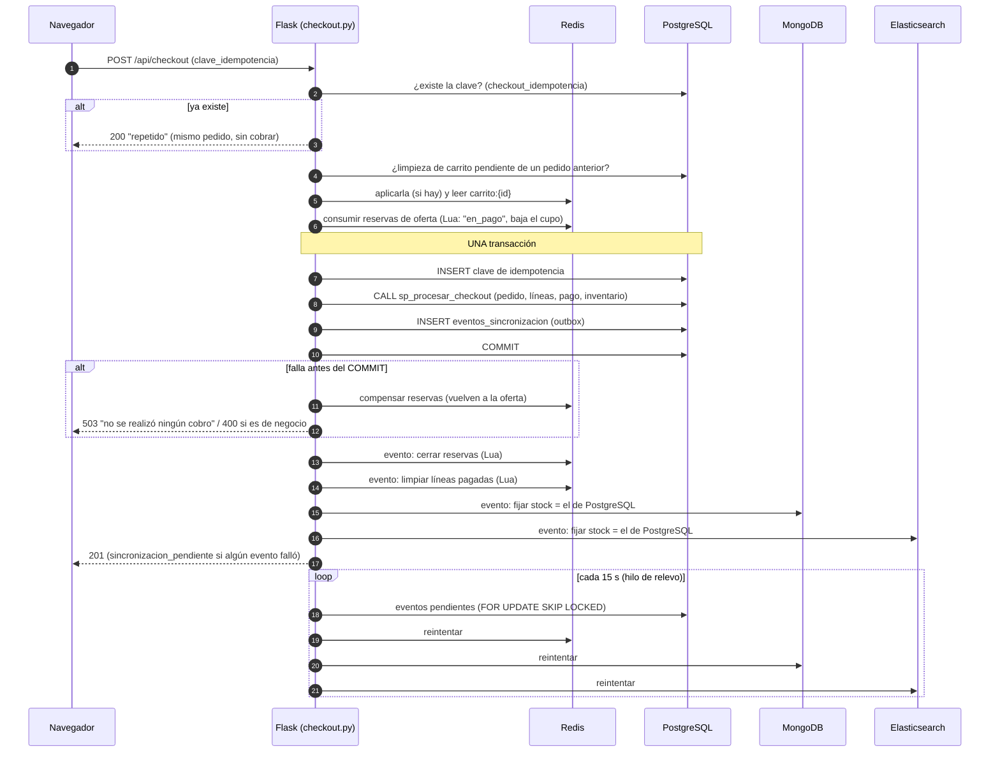

# Estrategia de consistencia del checkout distribuido

Entrega 3 · TiendaYa · última actualización: 6 de octubre de 2026

Este documento identifica cada componente que participa en el checkout, cada punto en el que el flujo puede fallar a medias y el mecanismo con el que se mitiga cada uno. También describe la prueba de falla simulada que lo respalda. El código está en [`backend/app/blueprints/checkout.py`](../backend/app/blueprints/checkout.py) y en [`backend/app/sincronizacion.py`](../backend/app/sincronizacion.py), y la evidencia, en [`docs/evidencia/prueba_fallas_checkout.txt`](evidencia/prueba_fallas_checkout.txt).

---

## 1. El problema

Hasta la Entrega 2, el checkout ya tocaba dos motores (Redis y PostgreSQL) y tenía un orden pensado para fallar sin sobrevender. Al terminar la Entrega 3 toca **cuatro**, y no existe una transacción que los abarque a todos:

| Componente | Qué hace en el checkout | Rol |
|---|---|---|
| **PostgreSQL** | `sp_procesar_checkout`: crea el pedido, sus líneas y el pago y descuenta el `inventario`, todo en una transacción con `SELECT ... FOR UPDATE` | **Fuente de verdad** del pedido, el pago y el stock |
| **Redis** | Guarda el carrito (`carrito:{id}`) y las reservas de oferta relámpago (`oferta:{pid}:reservas`, scripts Lua atómicos) | Estado transitorio de la compra |
| **MongoDB** | Guarda una copia del stock en el documento del producto, que es lo que ve el comprador en la página del producto | Proyección de lectura del catálogo |
| **Elasticsearch** | Guarda una copia del stock en el índice del buscador | Proyección de lectura para la búsqueda |

Cualquiera de esos motores puede caerse en cualquier momento del flujo. La pregunta del enunciado es qué pasa entonces: qué queda guardado, qué ve el usuario y cómo vuelve el sistema a un estado correcto.

## 2. Garantías que se buscan

Ordenadas por importancia:

1. **Nunca cobrar dos veces la misma compra**, ni por un reintento del cliente ni por un carrito que no se limpió.
2. **Nunca vender más de lo que hay**, ni del inventario ni del cupo de una oferta.
3. **Pedido, líneas, pago e inventario son atómicos**: o se registra todo o nada.
4. **Un pedido confirmado es definitivo**: si después falla otro motor, el pedido sigue siendo válido y lo que falta se completa solo.
5. **El usuario siempre sabe qué pasó**: si se le cobró o no, y si puede reintentar.

Lo que **sí se acepta** es una ventana de **consistencia eventual** en las proyecciones de lectura. Durante unos segundos, el stock que muestran MongoDB y Elasticsearch, o el contenido del carrito en Redis, puede no reflejar todavía un pedido ya confirmado. Esto no rompe ninguna de las garantías de arriba, porque el checkout valida siempre contra PostgreSQL.

## 3. Alternativas consideradas

| Alternativa | Por qué sí | Por qué no |
|---|---|---|
| **A. No cambiar nada** (la versión de la Entrega 2: copias de stock "de mejor esfuerzo" después del COMMIT, sin reintentos) | Simple; ya acotaba la sobreventa | Si MongoDB fallaba, su stock quedaba mal **para siempre** (hasta la próxima compra de ese producto). Si el cliente reintentaba tras un timeout, o si Redis no podía borrar el carrito, **se cobraba dos veces**. Nadie se enteraba de lo que había fallado. |
| **B. Commit en dos fases (2PC / XA)** entre los cuatro motores | Atomicidad fuerte | Redis, MongoDB y Elasticsearch no participan en transacciones XA con PostgreSQL. Aunque lo hicieran, 2PC bloquea a todos si el coordinador cae, y ata la disponibilidad del pago a la del buscador: una caída de Elasticsearch impediría comprar. |
| **C. Saga orquestada pura** (cada paso en su motor, con una compensación por paso) | No necesita 2PC | Para "copiar stock al catálogo" no existe una compensación con sentido; lo correcto es **completarlo**, no deshacer el pedido. Deshacer un pago porque falló el buscador sería peor que tener el buscador desactualizado unos segundos. |
| **D. Elegida: una transacción local en PostgreSQL + compensación previa + outbox con reintentos idempotentes + clave de idempotencia** | Cada paso usa el mecanismo que le corresponde (ver abajo) | Más piezas que A. Ventana de consistencia eventual en las proyecciones (aceptada a propósito). |

## 4. Decisión: cómo se ordena el flujo

La clave es que **solo PostgreSQL decide si hubo compra**. Lo que pasa antes del COMMIT se puede **compensar**, y lo que pasa después se **completa** con reintentos, nunca se deshace.



### 4.1 Antes del COMMIT: compensación

Las reservas de oferta relámpago se consumen en Redis **antes** de llamar al procedimiento, con un script Lua atómico (`consumir_reserva_oferta.lua`): la reserva pasa a `en_pago` y se descuenta del cupo. Si después falla cualquier cosa antes del COMMIT (Redis, el procedimiento o la base), se ejecuta `compensar_reserva_oferta.lua`: las unidades vuelven al cupo y la reserva vuelve a `activa`, con su vencimiento original. Se consume antes y no después porque así **nunca hay sobreventa**: si se cobrara primero y se apartara después, dos compradores podrían pagar la última unidad.

### 4.2 El COMMIT: una sola transacción con tres escrituras

En la **misma** transacción de PostgreSQL se escriben:

1. **La clave de idempotencia** (`checkout_idempotencia`), primero. Si llega otra petición con la misma clave mientras esta sigue en curso, su `INSERT` espera al índice único y después falla. Esa segunda petición devuelve el pedido de la primera en vez de cobrar otra vez.
2. **El pedido**, con `sp_procesar_checkout` (sin cambios desde la fase inicial).
3. **Los eventos del outbox** (`eventos_sincronizacion`): uno por cada tarea pendiente en los otros motores.

O se confirman las tres o ninguna. Por eso **todo pedido confirmado tiene registrado su trabajo pendiente**, aunque el proceso de Flask muera un milisegundo después del COMMIT. Y una clave de idempotencia solo existe si su pedido existe: si el pago falla, la clave se revierte y el usuario puede reintentar con ella.

### 4.3 Después del COMMIT: outbox con reintentos idempotentes

Apenas se confirma el pedido, el mismo request intenta ejecutar sus eventos (el caso normal es que todos se procesen al instante). Si alguno falla, queda `pendiente` con su error. Un hilo de relevo ([`sincronizacion.py`](../backend/app/sincronizacion.py)) lo reintenta cada 15 s con espera exponencial (5 s, 10 s, 20 s… hasta 5 min). Tras 10 intentos lo marca `fallido` para revisión manual en el panel admin (pestaña **Sincronización**).

Para que los reintentos sean seguros, **cada evento es idempotente**:

| Evento | Motor | Qué hace | Por qué repetirlo no hace daño |
|---|---|---|---|
| `confirmar_reserva_oferta` | Redis | Cierra la reserva como vendida | El Lua solo la borra si sigue `en_pago` **de esa oferta**; si ya no está, no hace nada |
| `limpiar_carrito` | Redis | Quita del carrito las líneas pagadas | El Lua (`limpiar_carrito_comprado.lua`) solo borra una línea si su valor sigue **igual** al que se pagó. Lo que el comprador agregó después no se toca |
| `stock_mongo` | MongoDB | Copia el stock al documento del producto | **Fija** el valor que hay en PostgreSQL al momento de ejecutarse; no resta. Repetirlo, o ejecutar en desorden eventos de varios pedidos, da el mismo resultado |
| `stock_elasticsearch` | Elasticsearch | Copia el stock al índice | Igual que el anterior (`update_by_query` con valor absoluto) |
| `indexar_producto` | Elasticsearch | Reindexa un producto editado en el admin cuyo indexado falló | Reemplaza el documento entero (mismo `_id`) con lo que hay hoy en MongoDB |

El relevo toma los eventos con `SELECT ... FOR UPDATE SKIP LOCKED`, así que si hay dos procesos de relevo a la vez (por ejemplo, el hilo de fondo y un checkout), cada evento lo procesa uno solo. Aunque no fuera así, los eventos son idempotentes.

### 4.4 Del lado del cliente: la clave de idempotencia

El navegador genera una clave (`crypto.randomUUID()`) por cada intento de compra y **la conserva entre reintentos**. Solo la cambia cuando la compra se confirma. Esto resuelve el caso más peligroso de todos: la respuesta del pago se pierde (timeout, se cae la red) y el usuario no sabe si se le cobró. Reintentar con la misma clave devuelve el pedido original (`200`, `"repetido": true`) si ya se había confirmado, o hace la compra si no.

La clave queda asociada al comprador que la usó; si llega con otro `id_comprador`, responde `409 CLAVE_IDEMPOTENCIA_AJENA`. Para que esa comparación no dependa del tipo de dato del JSON, `id_comprador` se normaliza a entero al inicio del checkout: se acepta un número (`12`) o un string numérico (`"12"`), y cualquier otro valor responde `400`. Hasta el 2026-10-06, reintentar con `"12"` la propia compra respondía `409` ([H-004](hallazgos.md)).

## 5. Puntos de falla y su mitigación

Para cada punto: qué queda guardado, qué ve el usuario y qué escenario de la prueba lo demuestra (sección 7).

| # | Dónde falla | Estado resultante | Mitigación | Respuesta y mensaje al usuario | Prueba |
|---|---|---|---|---|---|
| F1 | Redis, al **leer el carrito** | Nada cambió | Se corta antes de tocar nada | `503 CARRITO_NO_DISPONIBLE`: "No pudimos leer tu carrito… No se realizó ningún cobro; intenta de nuevo" | **E1** |
| F2 | Redis, al **consumir reservas** de oferta | Algunas reservas pudieron quedar `en_pago` | Se compensan las ya consumidas | `503`: "No pudimos apartar tu oferta… No se realizó ningún cobro" | — |
| F3 | La reserva de oferta **ya venció** o hay otro pago en curso | Nada cambió | Se compensan las demás y se quita la línea vencida | `409 RESERVA_OFERTA_EXPIRADA` / `PAGO_EN_CURSO` | Entrega 2 |
| F4 | El procedimiento rechaza el pedido (**error de negocio**: sin stock, dirección ajena…) | Rollback | Compensación de reservas | `400` con el mensaje del procedimiento | — |
| F5 | **PostgreSQL cae** antes o durante el COMMIT | Rollback: no hay pedido, pago, descuento de inventario ni clave de idempotencia | Compensación de reservas; la clave sigue libre para reintentar | `503 PAGO_NO_CONFIRMADO`: "No se realizó ningún cobro y tu carrito sigue intacto" | **E2** |
| F6 | **Se pierde la respuesta** después del COMMIT (timeout, red) | El pedido existe; el cliente no lo sabe | Clave de idempotencia | El frontend dice "no sabemos si se completó; reintentar es seguro". El reintento devuelve `200 repetido` con el mismo pedido | **E0** |
| F7 | Dos peticiones **simultáneas** con la misma clave | Una gana | El índice único de `checkout_idempotencia` serializa el `INSERT` | La segunda recibe `200 repetido` | — |
| F8 | El proceso Flask **muere** entre consumir reservas y el COMMIT | Reservas `en_pago` sin pedido | Se purgan solas a los 5 min (`MARGEN_PAGO_MS`); sus unidades quedan como vendidas | Error de conexión; el usuario reintenta | Entrega 2 |
| F9 | El proceso **muere justo después** del COMMIT | Pedido confirmado; eventos sin ejecutar | Los eventos ya están en la tabla; el relevo los ejecuta al volver | Error de conexión; el reintento con la misma clave devuelve el pedido | (cubierto por E3/E4) |
| F10 | **Redis cae después** del COMMIT | Pedido válido; las líneas pagadas siguen en el carrito; reservas sin cerrar | Eventos `limpiar_carrito` y `confirmar_reserva_oferta` pendientes. **Además, todo checkout aplica antes la limpieza pendiente de ese comprador**, así lo ya pagado no se puede cobrar otra vez, ni siquiera con otra clave | `201` con `sincronizacion_pendiente`: "Tu pedido está confirmado… tu carrito puede tardar unos segundos en actualizarse" | **E3** |
| F11 | **MongoDB cae después** del COMMIT | La página del producto muestra el stock viejo | Evento `stock_mongo` pendiente; el relevo lo corrige | `201` con aviso de sincronización pendiente | **E4** |
| F12 | **Elasticsearch cae** (después del COMMIT, o directamente está caído) | El buscador muestra el stock viejo o no responde | Evento `stock_elasticsearch` pendiente. El checkout **no depende** del buscador. Si el motor no está disponible, el buscador responde `503` y la búsqueda cae a la de MongoDB con un aviso (si Elasticsearch está arriba y rechaza la consulta, responde `400 BUSQUEDA_NO_VALIDA`, sin respaldo) | `201`; en el buscador, "búsqueda simplificada" | **E5** (caída real) |
| F13 | Falla la **compensación** (Redis cae justo después de que falló PostgreSQL) | Unidades de la oferta "perdidas" | Criterio conservador: se prefiere dejar unidades sin vender antes que sobrevender | `503` igual que F5 | — |
| F14 | Un evento **agota sus 10 intentos** | Evento `fallido` | Queda visible en el panel admin, con su último error, y se puede volver a encolar con un clic | — (solo afecta proyecciones de lectura) | — |

## 6. Ventanas de consistencia eventual

| Dato | Puede quedar desactualizado respecto de PostgreSQL… | Durante cuánto |
|---|---|---|
| Stock en MongoDB (página del producto) | si MongoDB falla tras el COMMIT | Hasta el siguiente intento del relevo: el primer reintento llega entre 5 y 20 s después (5 s de espera más hasta 15 s del ciclo del relevo). En la prueba E4 ([evidencia](evidencia/prueba_fallas_checkout.txt)) convergió en 20 s (12 s y 16 s en las dos corridas del 2026-10-06) |
| Stock en Elasticsearch (buscador) | si Elasticsearch falla tras el COMMIT o está caído | Mientras esté caído, más un ciclo del relevo. En la prueba con caída real (E5) convergió 25 s después de levantarlo (31 s y 15 s en las dos corridas del 2026-10-06) |
| Contenido del carrito en Redis | si Redis falla tras el COMMIT | Hasta el siguiente reintento, o hasta que el comprador vuelva a pagar (en ese caso se aplica en el acto) |
| Reserva de oferta "en_pago" sin cerrar | si Redis falla tras el COMMIT | Hasta el reintento; como máximo, 5 min (se purga sola, ya contada como vendida) |

Si un motor queda caído más de unos 25 minutos seguidos, sus eventos pasan a `fallido` (10 intentos) y requieren volver a encolarlos desde el panel admin. En ningún caso esto afecta pedidos, pagos ni inventario.

## 7. Prueba de falla simulada

### 7.1 Cómo se simula

Con `PERMITIR_FALLAS_SIMULADAS=1` en el `.env` (solo en desarrollo; en `.env.example` viene en `0`), `POST /api/checkout` acepta `"simular_falla": "<punto>"`, que lanza una excepción real en ese punto del flujo:

| Punto | Qué simula |
|---|---|
| `redis_lectura_carrito` | Redis lanza `ConnectionError` al leer el carrito |
| `postgres_antes_commit` | PostgreSQL lanza `OperationalError` (conexión perdida) después de ejecutar el procedimiento y antes del COMMIT |
| `redis_post_commit` | Los eventos de Redis fallan después del COMMIT |
| `mongo_post_commit` | El evento de MongoDB falla después del COMMIT |
| `elasticsearch_post_commit` | El evento de Elasticsearch falla después del COMMIT |

Además, la prueba E5 detiene **de verdad** el contenedor de Elasticsearch (`docker compose stop elasticsearch`), sin simular nada.

En el navegador, con las fallas habilitadas, el formulario de checkout muestra un selector **"Simular falla (solo desarrollo)"**, para hacer la demostración frente al curso.

### 7.2 Script y resultado

[`backend/scripts/prueba_fallas_checkout.py`](../backend/scripts/prueba_fallas_checkout.py) hace compras reales y, para cada escenario, verifica directamente en PostgreSQL, Redis, MongoDB y Elasticsearch que el estado sea el prometido. Resultado de la corrida del 5 de octubre de 2026 ([salida completa](evidencia/prueba_fallas_checkout.txt)): **45/45 verificaciones correctas**.

| Escenario | Qué se comprobó |
|---|---|
| **E0** Camino feliz + reintento con la misma clave | 201 y un solo pedido; stock igual en los tres motores; carrito limpio; todos los eventos procesados. El reintento devolvió `200 repetido`, mismo pedido, sin descontar stock otra vez |
| **E1** Redis cae al leer el carrito | `503 CARRITO_NO_DISPONIBLE` con "no se realizó ningún cobro"; sin pedido; stock y carrito intactos; sin clave de idempotencia |
| **E2** PostgreSQL cae antes del COMMIT, con una oferta relámpago en el carrito | `503 PAGO_NO_CONFIRMADO`; sin pedido; inventario intacto; la clave de idempotencia se revirtió. **Compensación**: la reserva volvió a `activa` (2 reservadas, 0 vendidas). Reintentar con la misma clave **sí** compró: 2 vendidas en la oferta y 2 menos en PostgreSQL |
| **E3** Redis cae después del COMMIT | `201` con `sincronizacion_pendiente`; las líneas pagadas seguían en el carrito y el evento quedó pendiente con su error. Un checkout con **otra** clave sobre ese carrito respondió `409 CARRITO_VACIO`, sin cobrar de nuevo. El reintento con la misma clave respondió `200 repetido`. Siempre hubo un solo pedido |
| **E4** MongoDB cae después del COMMIT | `201`; MongoDB quedó con el stock viejo (37 contra 36 en PostgreSQL) mientras Elasticsearch sí se actualizó; **el relevo lo corrigió solo en 20 s** (evento procesado en el 2.º intento) |
| **E5** Caída **real** de Elasticsearch | El buscador respondió `503 BUSCADOR_NO_DISPONIBLE`; el checkout siguió funcionando (`201`) y MongoDB quedó al día; el evento de Elasticsearch quedó pendiente con `ConnectionError`. **25 s después de levantar el contenedor**, el relevo puso el stock al día |

Para reproducirla (con el backend corriendo y `PERMITIR_FALLAS_SIMULADAS=1`):

```bash
python backend/scripts/prueba_fallas_checkout.py                 # E0-E4
python backend/scripts/prueba_fallas_checkout.py --caida-real    # + E5 (detiene y levanta Elasticsearch)
```

La prueba crea pedidos reales en la base local, del comprador `maria.torres@email.com`.

## 8. Limitaciones asumidas

- **El relevo es un hilo dentro del proceso de Flask.** Si Flask está caído, nadie reintenta, aunque los eventos quedan guardados y se procesan al volver. Con varias instancias del backend funcionaría igual (gracias a `SKIP LOCKED`), pero lo natural sería un proceso aparte.
- **El relevo mantiene el bloqueo de cada evento mientras llama al motor externo.** Con el timeout de 5 s del cliente y lotes de hasta 100 eventos, es aceptable a esta escala.
- **La clave de idempotencia es opcional en la API**, para no romper scripts existentes. El frontend siempre la manda; un cliente que no la mande no tiene protección contra reintentos.
- **La secuencia de `pedidos` tiene huecos**: un pedido revertido consume su número (en la evidencia, el pedido de E2 que falló dejó un salto). Es el comportamiento normal de `SERIAL` en PostgreSQL y no afecta la consistencia.
- **Sin autenticación en el servidor**: el `id_comprador` lo manda el cliente, igual que en las entregas anteriores. Es tema de la entrega final.
- **Neo4j no participa del checkout**: las reseñas se sincronizan aparte, con su propio criterio de mejor esfuerzo (Entrega 2).
- **El precio editado en el admin solo vive en MongoDB**, así que el checkout cobra el de PostgreSQL. No es un problema de esta estrategia, sino una limitación conocida desde la Entrega 1 (ver `README.md`).
